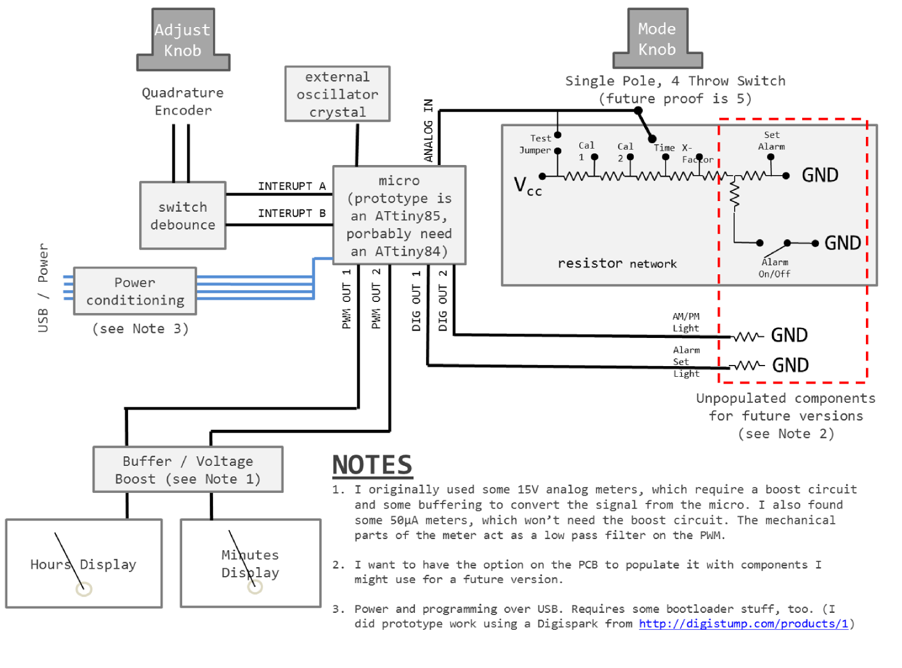

#Short background of the requirements:

The microchip is meant to run a "voltmeter clock." It's responsible for time keeping, sending PWM signals to the meters, reading inputs from the control knobs, and so on. The prototype was controlled with a Digispark hobby board and I'm trying to develop a short run production version. (probably more than 100 units and less than 1000)  

Prototype program code was around 5kB on a Digispark board (atTiny85) using the Arduino environment plus whatever bootloader was already burned on the chip

##System Diagram

##Pin requirements
(beyond what's on the Digispark) would be as follows:

1 analog in to read selector switch / voltage divider  
2 interrupts to read quadrature encoder  
2 PWM outputs  
3 digital outputs for am/pm light, alarm set, and buzzer  
2 pins for external oscillator crystal

ISP connection
